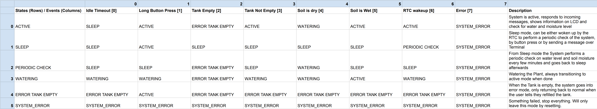

# Plant Watering System

This is my final project for the Making Embedded Systems Course by Elecia White (Yellow Seahorses Cohort in 2022).

## Application Description
The watering system is used to water plants at home. When active, it checks the soil moisture around the plant.
If the moisture level is below a preset value it will water the plant until the soil is moist again.
When inactive for a while, it will go to sleep.
Every 10 minutes it wakes up and checks for the soil moisture, the water level of the tank and then goes back to sleep again. 
If the soil moisture is below the set value, it will water the plant and go into active mode.
If the tank is empty, the system will notify the user by blinking an LED and displaying a warning message on the LCD screen while also preventing the system from working until the tank is filled again.
The system needs the user to push the button for a few seconds to tell it, the tank has been filled again.

The user has two ways to interact with the system. First, by pressing a button the system gets active (when in sleep mode)
and displays information on an LCD screen which you can cycle through by pressing the button again. 
A long press on the button will cause the system to go into sleep mode.
Second, by interfacing to it with a UART Terminal, that is used for debugging and setting the moisture level at which the system should water the plant.

For the watering itself, the system uses a small tank and a peristaltic pump. 
The water level in the tank is monitored by an ultrasonic distance sensor. 
If the tank is empty, the system will notify the user by blinking an LED and displaying a warning message on the LCD screen.
The distance at which the system considers the tank to be empty is set via the UART Terminal.

The system also makes predictions, based on previous times, about how long the remaining water in the tank will last.
This information is also available on the LCD Screen by cycling through it with the button or by requesting them over the UART Terminal.
It can be used to calculate how much water the plant will probably need for example if you go on vacation.

To find out what soil moisture level is correct you need to calibrate the system with experimental data of dry and moist soil and then figure out a good moisture value.

A full state machine of the system: 
The state machine can also be found [here](https://docs.google.com/spreadsheets/d/1Z40RKTnW3gGIQifepFi1jO9dVKSzbtFp8474BN1ClBw/edit?usp=sharing).
